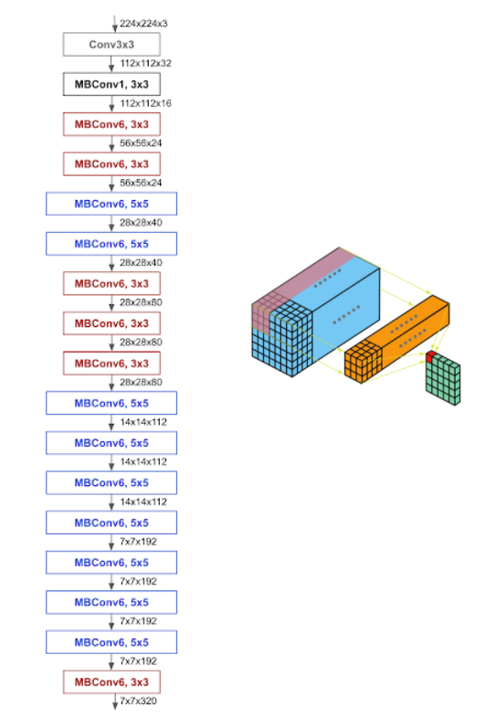
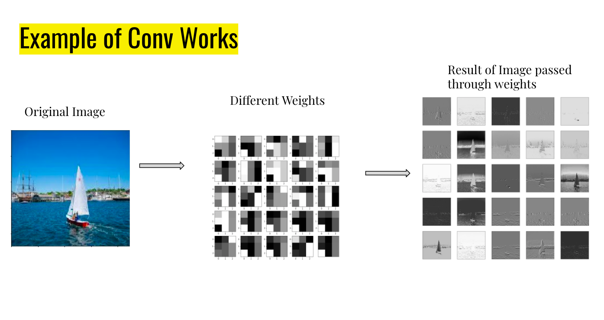
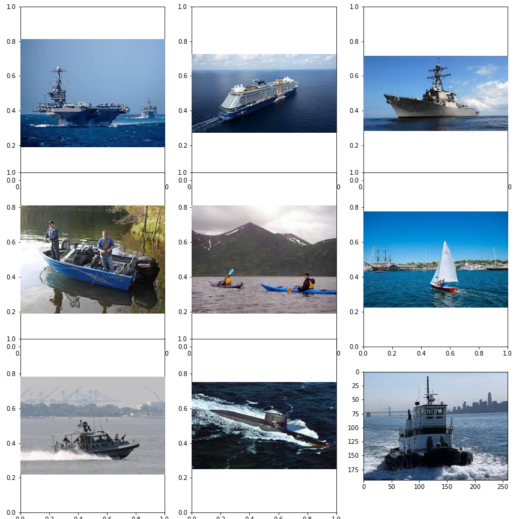

# Boat-Classifier

While I was enlisted in the Navy, my job involved harbor security operations. We had two main responsibilities, escort submarines in and out of the port and identify and classify vessels in the area of responsibility. I had always wondered if the second part of the job could be done with machine learning. However, now that I am a Data Scientist, I decided to try to create a machine learning model that could classify common ships and boats that I would see every day.

### Resources

- The Images used were scraped from Google images
- Transfer learned from 2 different models:
  - VGG16 :13 convolutional layers, 5 pooling layers and 3 dense layers and 134m total parameters. 16m trainable
  
  - EfficentNetB0 : 230 layers that include 49 convolutional layers and 68m total parameters . 64m trainable parameters

The final model used for fitting and training was EfficentNetB0. EfficentNetB0 involves a method called Compound Scaling and uses a compound coefficient to uniformly scale width, depth, and resolution in a principled way. The user-specified coefficient controls resources (e.g. Floating Point Operations (FLOPs)) available for model scaling.

#### EfficentNetB0 structure:

### How a CNN:

Convolutional Neural Networks (CNN) are used in image processing and machine learning to effectively detect features and details. An image is passed through neurons with trainable and changeable weights that are all interconnected where at the end there’s an output. This output is than assessed and information is sent backwards to change the weights of the CNN.

Above you can see an example of how the weights associated with the nodes affect how the computer "sees" the image. These weights help the computer identify edges and details that help in the overall classification of the image.

### Images:

In this project I decided to use 9 different classes of boats. These classes derived from real world experiences I had working as a Harbor Security Boat Coxswain. The 9 different classes that model was trained on were Cruise ships, Destroyers, Security Boats, Fishing Boats, Submarines, Carriers, Sailboats, Kayaks and Tugs.
The total number of images used was 1,090, all split into 3 groups, a Training, Testing, and Validation group. The training and validation group were used to fit the model and the test group was used to test the model.

